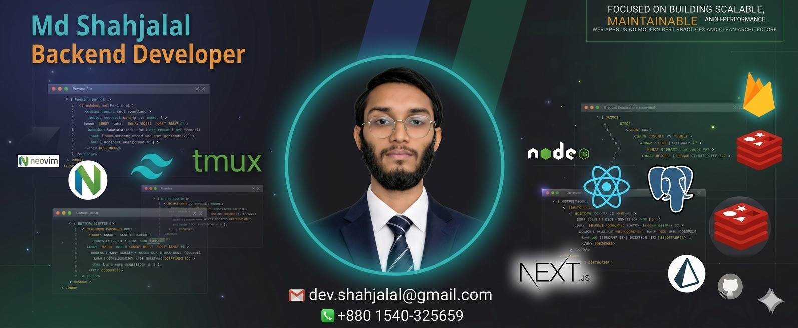

## 

## 👋 Assalamu Alaikum, I'm **Md. Shahjalal**

Experienced **MERN Stack Developer** focused on building **scalable**, **maintainable**, and **high-performance** web apps using **modern best practices** and clean architecture.

- Terminal-first workflow on **Hyprland (Wayland)** & **EndeavourOS**, powered by **Neovim**, **Zsh**, **Tmux**

🎯 Open to **Frontend** or **Full-Stack** roles in modern, product-driven teams.

---

# 💻 Tech Stack

| Category             | Technologies                                                                                                                                                                                                                                                                                                                                                                                                                                                                                                                                                                                                                                                                                      |
| -------------------- | ------------------------------------------------------------------------------------------------------------------------------------------------------------------------------------------------------------------------------------------------------------------------------------------------------------------------------------------------------------------------------------------------------------------------------------------------------------------------------------------------------------------------------------------------------------------------------------------------------------------------------------------------------------------------------------------------- |
| **Languages**        |                                                                                                                                                                                                                                                                                                                          |
| **Frontend**         |                                                                                                                                                                                                                                                                            |
| **Backend**          |                                                                                                                                                                                                                                                                                                                                                                                                                                                                                             |
| **Database**         |                                                                                                                                                                                                                                                                                                                                                                                                                                                                                                                                                                                                   |
| **Auth & Hosting**   |                                                                                                                                                                                                                                                                                                     |
| **Design & UI**      |                                                                                                                                                                                                                                                                                                                                                                                                                                                                                                                                                                                                         |
| **Productivity CLI** |        |

---

# 📊 GitHub Stats

## 📞 Contact Me

Feel free to reach out or connect with me!

| 📧 Email                    | 📱 Phone    | 💼 LinkedIn                                               | 🐙 GitHub                                           |
| --------------------------- | ----------- | --------------------------------------------------------- | --------------------------------------------------- |
| muhommodshahjalal@gmail.com | 01540325659 | [LinkedIn Profile](https://www.linkedin.com/in/your-name) | [shahjalal-labs](https://github.com/shahjalal-labs) |

---

### 🔗 Quick Links

---

### 🚀 Featured Projects

- 🔄 **DevBoost CLI** – A CLI-based developer toolkit for Git, Neovim, and tmux automation. [Repo →](https://github.com/shahjalal-labs/devboost)
- 🛒 **MERN Commerce** – Full-stack e-commerce platform using React, Node, MongoDB. [Live Demo →](https://yourprojectlink.com)

[📂 Portfolio](https://shahjalal-labs.surge.sh/)

### 🤝 Let’s Connect!

Open to collaborations, freelance projects, and full-time opportunities.  
Feel free to reach out — I’d love to hear from you!

### ✍️ Random Dev Quote

---

<!--
Md. Shahjalal – MERN Stack Developer | React, TypeScript, Firebase, Neovim, Hyprland, Tmux | Open-source, CLI productivity, Linux-first
-->
