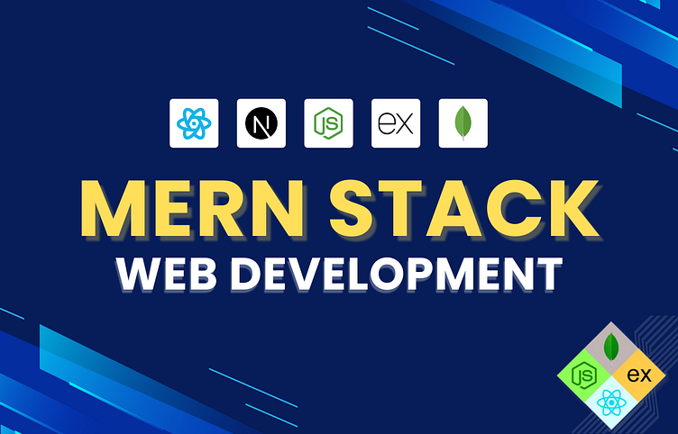

<h2 align="center">👋 Assalamu Alaikum, I'm <strong style="color:#ffffff;">Md. Shahjalal</strong></h2>

  <strong style="color:#10b981;">Experienced MERN Stack Developer</strong>  
  Focused on building <strong>scalable</strong>, 
  <strong>maintainable</strong>, and 
  <strong>high-performance</strong> web apps using 
  <strong>modern best practices</strong> and clean architecture.

---

### 🧠 Tech Stack

- <strong>MongoDB</strong>, <strong>Express.js</strong>, <strong>React</strong>, <strong>Node.js</strong>, <strong>TypeScript</strong>, <strong>Firebase</strong>, <strong>JWT</strong>
- Terminal-first workflow: <strong>Hyprland (Wayland)</strong>, <strong>EndeavourOS</strong>, <strong>Neovim</strong>, <strong>Zsh</strong>, <strong>Tmux</strong>

---

### 🎯 Career Focus

Open to <strong>Frontend</strong> or <strong>Full-Stack</strong> roles in modern, product-driven teams.

## 👋 Assalamu Alaikum, I'm <b style="color:purple; "><i>Md. Shahjalal</i></b>

Experienced **MERN Stack Developer** focused on building **scalable**, **maintainable**, and **high-performance** web apps using **modern best practices** and clean architecture.

- **MongoDB**, **Express.js**, **React**, **Node.js**, **TypeScript**, **Firebase**, **JWT**
- Terminal-first workflow on **Hyprland (Wayland)** & **EndeavourOS**, powered by **Neovim**, **Zsh**, **Tmux**

🎯 Open to **Frontend** or **Full-Stack** roles in modern, product-driven teams.

---

# 💻 Tech Stack:

| Skills Overview              | Technologies                                                                                                                                                                                                                                                                                                                                                                                                 |
| ---------------------------- | ------------------------------------------------------------------------------------------------------------------------------------------------------------------------------------------------------------------------------------------------------------------------------------------------------------------------------------------------------------------------------------------------------------ |
| **Languages**                |                                                                     |
| **Frontend Technologies**    |                                                                                                                                                                                                                                   |
| **Back-End Development**     |                                                                                                                                                                                                                                        |
| **Database**                 |                                                                                                                                                                                                                                                                                                                              |
| **Authentication & Hosting** |                                                                                                                                                           |
| **Tools & Platforms**        |      |

# 📊 GitHub Stats:

 
 

### ✍️ Random Dev Quote

---

<!-- Proudly created with GPRM ( https://gprm.itsvg.in ) -->

# 🌟 shahjalal-labs

## 📂 Project Information

| 📝 **Detail**           | 📌 **Value**                                                                                                     |
| ----------------------- | ---------------------------------------------------------------------------------------------------------------- |
| 🔗 **GitHub URL**       | [https://github.com/shahjalal-labs/shahjalal-labs](https://github.com/shahjalal-labs/shahjalal-labs)             |
| 🌐 **Live Site**        | [http://shahjalal-labs.surge.sh/](http://shahjalal-labs.surge.sh/)                                               |
| 💻 **Portfolio GitHub** | [https://github.com/shahjalal-labs/shahjalal-portfolio](https://github.com/shahjalal-labs/shahjalal-portfolio)   |
| 🌐 **Portfolio Live**   | [http://shahjalal-labs.surge.sh/](http://shahjalal-labs.surge.sh/)                                               |
| 📁 **Directory**        | `/run/media/sj/developer/web/L1B11/portfolio/shahjalal-labs`                                                     |
| 👤 **Username**         | `sj`                                                                                                             |
| 📅 **Created On**       | `25/06/2025 08:31 পূর্বাহ্ণ বুধ GMT+6`                                                                           |
| 📍 **Location**         | Sharifpur, Gazipur, Dhaka                                                                                        |
| 💼 **LinkedIn**         | [https://www.linkedin.com/in/md-sj-825bb4341/](https://www.linkedin.com/in/md-sj-825bb4341/)                     |
| 📘 **Facebook**         | [https://www.facebook.com/profile.php?id=61556383702555](https://www.facebook.com/profile.php?id=61556383702555) |
| ▶️ **YouTube**          | [https://www.youtube.com/@muhommodshahjalal9811](https://www.youtube.com/@muhommodshahjalal9811)                 |

---

> Feel free to connect with me.
