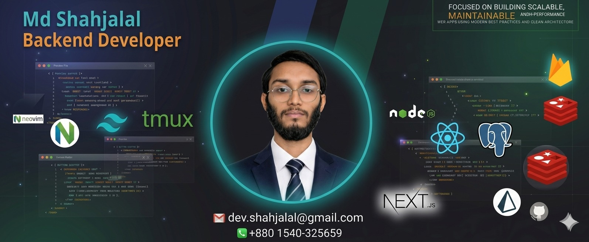
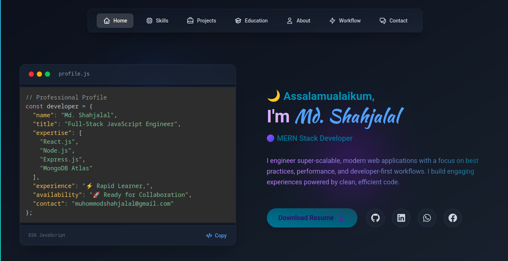
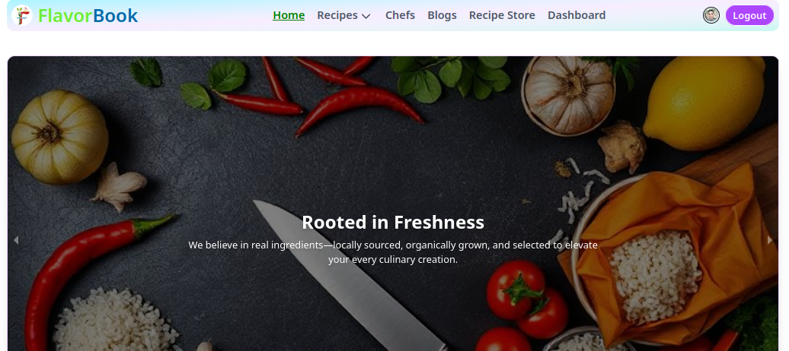
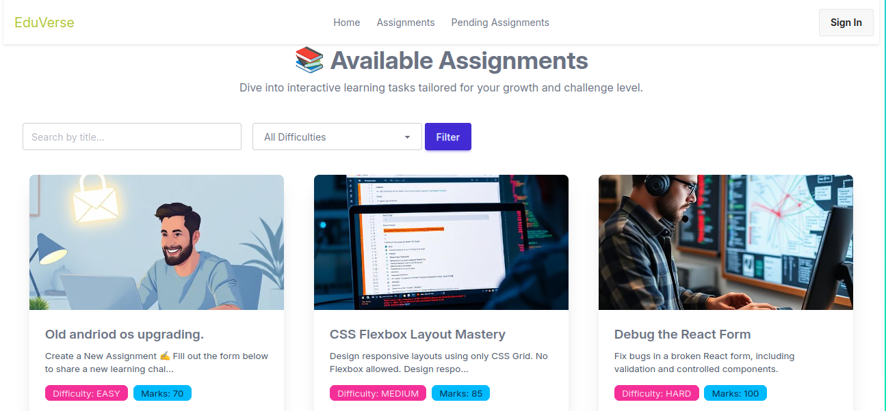
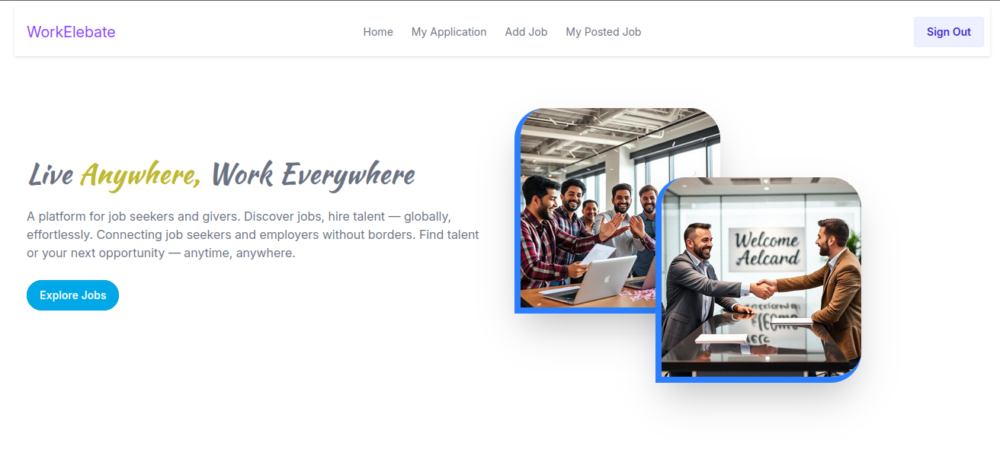
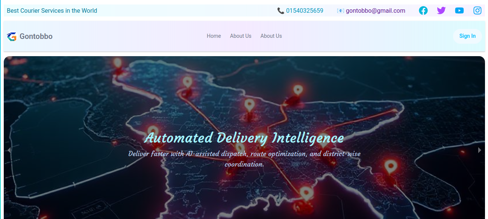
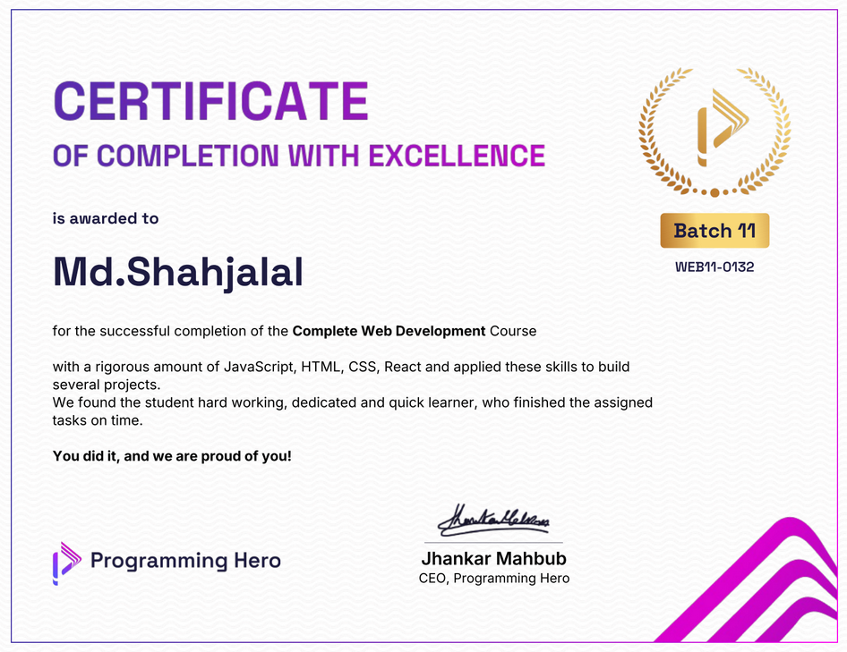
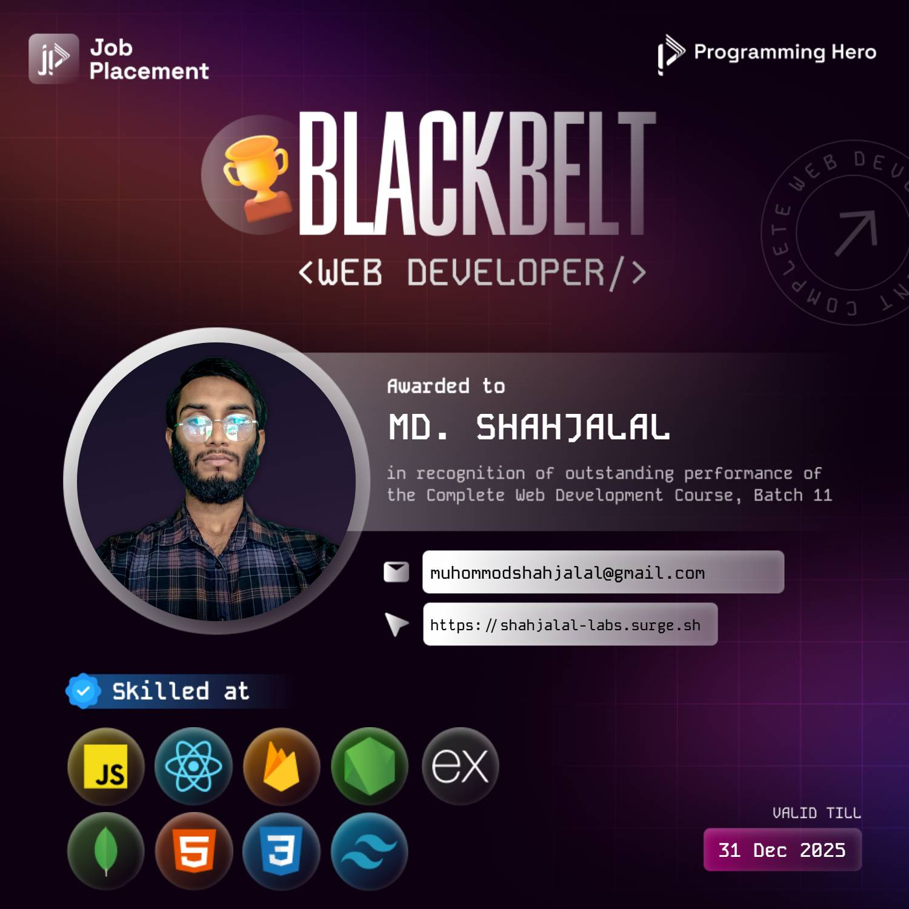

# 

## 👋 Assalamu Alaikum, I'm **Md. Shahjalal**

Backend Engineer focused on building scalable, high-performance systems with Node.js, TypeScript, and PostgreSQL.

I design and own production APIs, optimize databases, implement caching with Redis, and build real-time systems with WebSocket.

Contributed to mobile apps in production (App Store & Play Store).

- System design • Performance • Clean architecture
- CLI-first workflow (Hyprland(linux), Neovim, Tmux)

## 🎯 Open to Backend or Backend-heavy Full Stack roles.

# 💻 Tech Stack

| Category                         | Technologies                                                                                                                                                                                                                                                                                                                                                                                                                                                                        |
| -------------------------------- | ----------------------------------------------------------------------------------------------------------------------------------------------------------------------------------------------------------------------------------------------------------------------------------------------------------------------------------------------------------------------------------------------------------------------------------------------------------------------------------- |
| **Backend Core**                 |                          |
| **Database & Caching**           |                                            |
| **Auth & Security**              |                                                                                                                                                                                                                                             |
| **DevOps & Deployment**          |                                                                                                                                                                                                                       |
| **Frontend (Working Knowledge)** |                                                                                             |
| **Tools & Workflow**             |       |

# 📊 GitHub Stats

### 🧠 GitHub Contribution Activity

## 📞 Contact Me

Feel free to reach out or explore my work:

| 🌐 Portfolio                                       | 📧 Email                    | 📱 Phone       | 💼 LinkedIn                                                     | 🐙 GitHub                                           |
| -------------------------------------------------- | --------------------------- | -------------- | --------------------------------------------------------------- | --------------------------------------------------- |
| [Visit Portfolio](https://shahjalal-labs.surge.sh) | muhommodshahjalal@gmail.com | +8801540325659 | [LinkedIn Profile](https://www.linkedin.com/in/shahjalal-labs/) | [shahjalal-labs](https://github.com/shahjalal-labs) |

---

### 🔗 Quick Links

---

## 🚀 Projects by [shahjalal-labs](https://github.com/shahjalal-labs) &nbsp; 

Not just apps. These are **real-world platforms**—architected for scale, designed for humans, and built using the **power of MERN** 🚀

Every line of code, every animation, and every decision reflects a developer obsessed with quality, experience, and impact. 🚀✨

---

### 🛒 Commerzo — Multi-Vendor E-Commerce Backend ⚙️🧾

> A production-ready, multi-vendor e-commerce backend supporting multi-role auth, product variants, shopping cart, Stripe payments, seller payouts, real-time notifications, and BullMQ job processing.

📦 [Source Code](https://github.com/shahjalal-labs/commerzo_backend)  
📬 [API Docs](https://documenter.getpostman.com/view/53860662/2sBXirj8eQ)

🛠 **Tech Stack:**
`Node.js` • `TypeScript` • `Express` • `MongoDB` • `Prisma` • `Redis` • `BullMQ` • `Stripe` • `Firebase` • `AWS S3`

---

### 🤝 Guidely — Mentorship Networking Platform Backend 🧠👥

> A LinkedIn‑style professional networking backend for mentors and mentees — featuring smart connection suggestions, real‑time chat, scheduling, goal tracking, and push notifications.

📦 [Source Code](https://github.com/shahjalal-labs/guidely_backend)  
📬 [API Docs](https://documenter.getpostman.com/view/53860662/2sBXirjoP3)

🛠 **Tech Stack:**
`Node.js` • `TypeScript` • `Express` • `MongoDB` • `Prisma` • `Redis` • `BullMQ` • `Socket.io` • `Firebase` • `AWS S3`

## 

---

### 🍽️ SupplyBridge — B2B Restaurant Supply Backend 🔔🤝

> A real-time B2B collaboration platform for restaurant owners and food service vendors — featuring geo-based Ping requests, LinkedIn-style connections, live chat, and multi-channel notifications.

📦 [Source Code](https://github.com/shahjalal-labs/supply_bridge_backend)  
📬 [API Docs](https://documenter.getpostman.com/view/53860662/2sBXirk8nZ)

🛠 **Tech Stack:**
`Node.js` • `TypeScript` • `Express` • `MongoDB` • `Prisma` • `Redis` • `BullMQ` • `WebSocket` • `Firebase` • `AWS S3`

## 

---

### 🌟 DeshGuide — Tourism Management System 🇧🇩🗺️

> A full-featured tourism management platform featuring secure booking, story sharing, multi-role authentication, and a modern admin dashboard—empowering the future of travel in Bangladesh.

🔗 [Live Site](https://deshguide.surge.sh)  
📦 [Client Code](https://github.com/shahjalal-labs/DeshGuide-client)  
📦 [Server Code](https://github.com/shahjalal-labs/DeshGuide-server)  
⚙️ [Backend API](https://deshguide-server.vercel.app)  
🎥 [Preview Video](https://www.youtube.com/watch?v=V_u5M37B-es)  
🛠 **Tech Stack:**  
`React` • `Node.js` • `MongoDB` • `Firebase` • `Stripe` • `Tailwind CSS` • `TanStack Query` • `JWT` • `Framer Motion`

---

### 🌐 shahjalal-portfolio-v2 — Modern Developer Portfolio 🖥️✨

> A sleek, responsive portfolio website built with React, Tailwind CSS, Framer Motion, and Vite — designed to showcase my skills, projects, and workflow with smooth animations and modern UI.

🔗 [Live Site](https://shahjalal-labs.surge.sh/)  
📦 [Source Code](https://github.com/shahjalal-labs/shahjalal-portfolio-v2)  
🛠 **Tech Stack:**  
`React` • `Tailwind CSS` • `Framer Motion` • `Vite`

---

### 📘 FlavorBook — Recipe Sharing & Marketplace 🍲🧑‍🍳

> A full-featured platform that unites recipe sharing, chef booking, blog exploration, and a product marketplace—all in one seamless experience.

🔗 [Live Site](https://flavor-book.surge.sh)  
📦 [Source Code](https://github.com/shahjalal-labs/flavor-book-client)  
🛠 **Tech Stack:**  
`React` • `Express` • `Node.js` • `MongoDB` • `Tailwind CSS`

---

### 🎓 EduVerse — Online Group Assignment Platform 🧑‍🏫👥

> An interactive education portal for managing assignments, submissions, and peer evaluations in a collaborative learning environment.

🔗 [Live Site](https://edu-verse.surge.sh)  
📦 [Source Code](https://github.com/shahjalal-labs/eduverse-client)  
🛠 **Tech Stack:**  
`React` • `Express` • `Node.js` • `MongoDB`

---

### 📦 WorkElevate The Smart & Modern Job Portal for Job Seekers & Employers 🚚📬

> WorkElevate is your ultimate ultrasonic-powered platform, designed to connect talent with opportunity faster and smarter. It offers an intuitive, cutting-edge experience for job seekers and employers, bringing the future of hiring to Bangladesh today.

🔗 [Live Site](https://workelevate.surge.sh)  
📦 [Source Code](https://github.com/shahjalal-labs/WorkElebate/tree/main/client-WorkElebate)  
🛠 **Tech Stack:**  
`React` • `Node.js` • `MongoDB`

---

### 🧭 Gontobbo — Smart Parcel Infrastructure _(Ongoing)_ 🔄

> Modernizing parcel delivery services through automation, transparency, and real-time tracking. Currently under active development.

🔗 [Live Site](https://workelevate.surge.sh/)  
📦 [Source Code](https://github.com/yourname/codeverse)  
🛠 **Tech Stack:**  
`React` • `Node.js` • `MONGODB`

---

> 💡 For more projects and hands-on MERN innovations, visit my full [GitHub profile](https://github.com/shahjalal-labs).

<!-- ## 🏅 Certifications -->
<!---->
<!-- - **Complete Web Development Course with Excellence**   -->
<!--    Issued by **Programming Hero** | Batch 11 | ID: WEB11-0132   -->
<!--     -->
<!--   [📄 Credential](https://drive.google.com/file/d/1HS8uU_-fZIlHH-zX_XazxS-QIlzHfjRZ/view)   -->
<!--    -->
<!---->

# 🏅 Certifications

- **Blackbelt Web Developer**  
  Issued by **Programming Hero** | Batch 11 | Valid until: 31 Dec 2025  
  
  [📄 View Certificate](./assets/certificates/l1b11ScicBlackBelt.png)  
  

  **Skills Demonstrated:** JavaScript • React • Firebase • Node.js • Express.js • MongoDB • HTML5 • CSS3 • Tailwind CSS

  **Recognition:** Awarded for outstanding performance in the Complete Web Development Course, Batch 11

- **Complete Web Development Course with Excellence**  
  Issued by **Programming Hero** | Batch 11 | ID: WEB11-0132  
  
  [📄 Credential](https://drive.google.com/file/d/1HS8uU_-fZIlHH-zX_XazxS-QIlzHfjRZ/view)  
  

### 🤝 Let’s Connect!

Open to collaborations, freelance projects, and full-time opportunities.  
Feel free to reach out — I’d love to hear from you!

| 📧 Email                    | 📱 Phone       | 💼 LinkedIn                                                     | 🐙 GitHub                                           |
| --------------------------- | -------------- | --------------------------------------------------------------- | --------------------------------------------------- |
| muhommodshahjalal@gmail.com | +8801540325659 | [LinkedIn Profile](https://www.linkedin.com/in/shahjalal-labs/) | [shahjalal-labs](https://github.com/shahjalal-labs) |

---

### ✍️ Random Dev Quote

---

<!--
Md.Shahjalal – MERN Stack Developer | React, TypeScript, Firebase, Neovim, Hyprland, Tmux | Open-source, CLI productivity, Linux-first

-->
