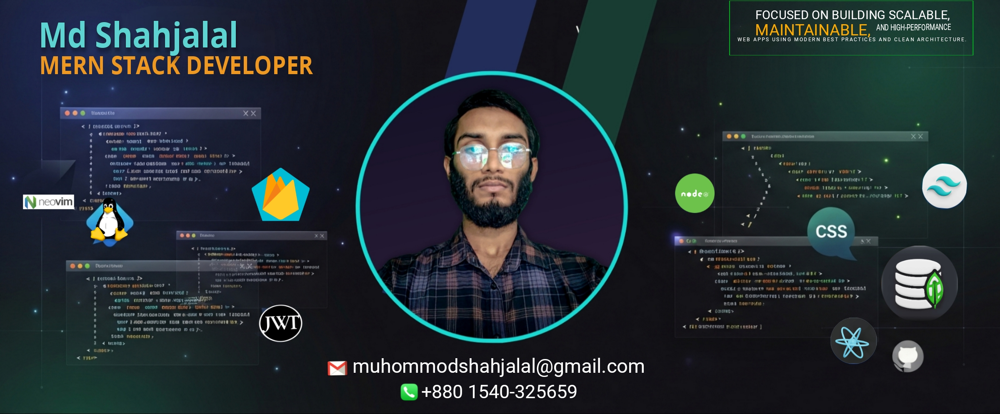
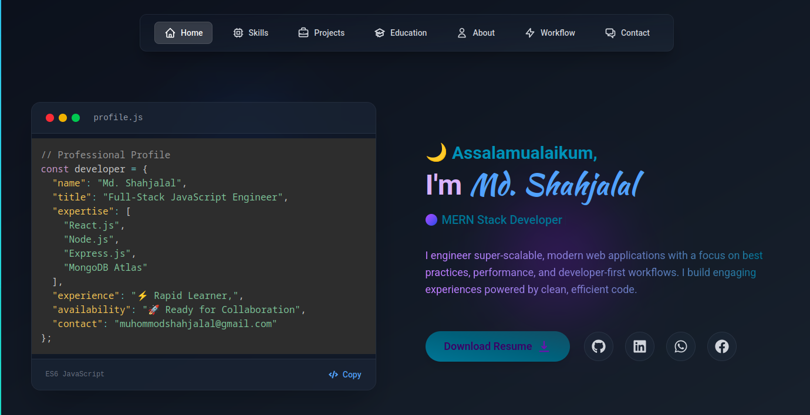
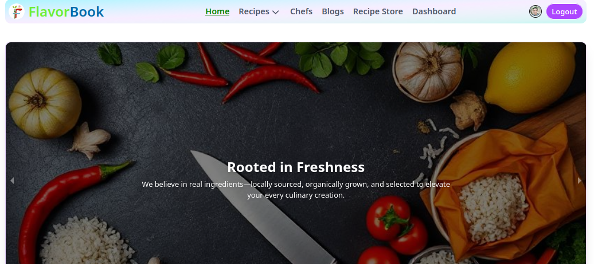
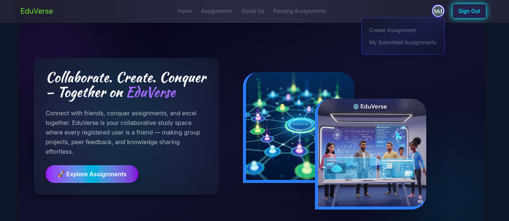
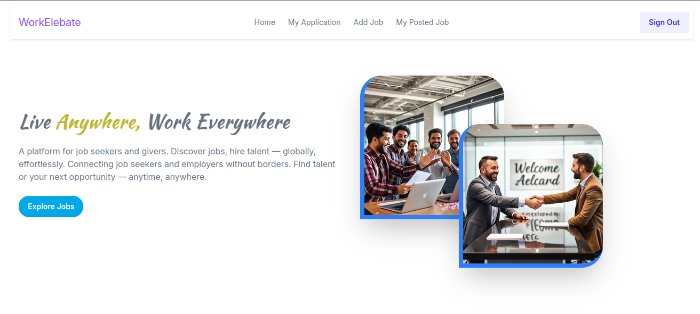
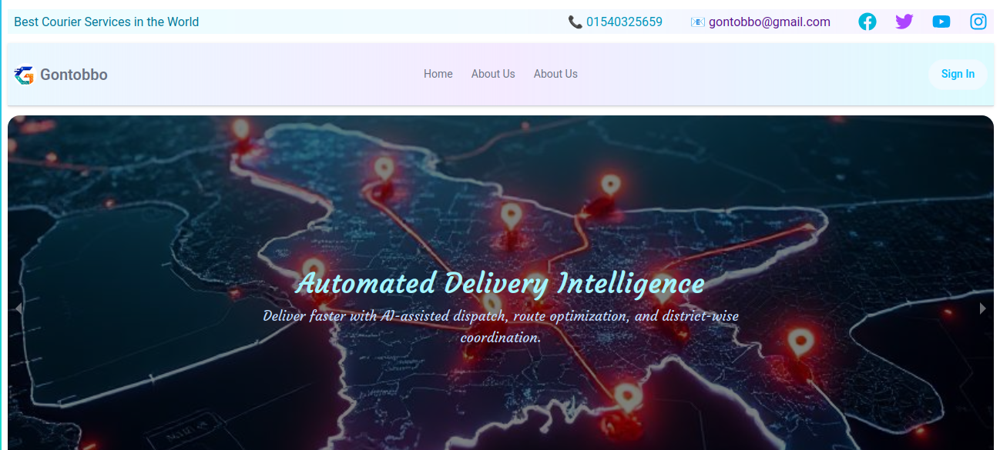

# 

## 👋 Assalamu Alaikum, I'm **Md. Shahjalal**

Experienced **MERN Stack Developer** focused on building **scalable**, **maintainable**, and **high-performance** web apps using **modern best practices** and clean architecture.

- Terminal-first workflow on **Hyprland (Wayland)** & **EndeavourOS**, powered by **Neovim**, **Zsh**, **Tmux**

🎯 Open to **Frontend** or **Full-Stack** roles in modern, product-driven teams.

---

# 💻 Tech Stack

| Category             | Technologies                                                                                                                                                                                                                                                                                                                                                                                                                                                                                                                                                                                                                                                                                      |
| -------------------- | ------------------------------------------------------------------------------------------------------------------------------------------------------------------------------------------------------------------------------------------------------------------------------------------------------------------------------------------------------------------------------------------------------------------------------------------------------------------------------------------------------------------------------------------------------------------------------------------------------------------------------------------------------------------------------------------------- |
| **Languages**        |                                                                                                                                                                                                                                                                                                                          |
| **Frontend**         |                                                                                                                                                                                                                                                                            |
| **Backend**          |                                                                                                                                                                                                                                                                                                                                                                                                                                                                                             |
| **Database**         |                                                                                                                                                                                                                                                                                                                                                                                                                                                                                                                                                                                                   |
| **Auth & Hosting**   |                                                                                                                                                                                                                                                                                                     |
| **Design & UI**      |                                                                                                                                                                                                                                                                                                                                                                                                                                                                                                                                                                                                         |
| **Productivity CLI** |        |

---

# 📊 GitHub Stats

### 🧠 GitHub Contribution Activity

## 📞 Contact Me

Feel free to reach out or connect with me!

| 📧 Email                    | 📱 Phone    | 💼 LinkedIn                                                     | 🐙 GitHub                                           |
| --------------------------- | ----------- | --------------------------------------------------------------- | --------------------------------------------------- |
| muhommodshahjalal@gmail.com | 01540325659 | [LinkedIn Profile](https://www.linkedin.com/in/shahjalal-labs/) | [shahjalal-labs](https://github.com/shahjalal-labs) |

---

### 🔗 Quick Links

---

## 🚀 Projects by [shahjalal-labs](https://github.com/shahjalal-labs)   

Not just apps. These are **real-world platforms**—architected for scale, designed for humans, and built using the **power of MERN** 🚀

Every line of code, every animation, and every decision reflects a developer obsessed with quality, experience, and impact. 🚀✨

---

### 🌟 DeshGuide — Tourism Management System 🇧🇩🗺️

> A full-featured tourism management platform featuring secure booking, story sharing, multi-role authentication, and a modern admin dashboard—empowering the future of travel in Bangladesh.

🔗 [Live Site](https://deshguide.surge.sh)  
📦 [Client Code](https://github.com/shahjalal-labs/DeshGuide-client)  
📦 [Server Code](https://github.com/shahjalal-labs/DeshGuide-server)  
⚙️ [Backend API](https://deshguide-server.vercel.app)  
🎥 [Preview Video](https://www.youtube.com/watch?v=V_u5M37B-es)
🛠 **Tech Stack:**  
`React` • `Node.js` • `MongoDB` • `Firebase` • `Stripe` • `Tailwind CSS` • `TanStack Query` • `JWT` • `Framer Motion`

---

### 🌐 shahjalal-portfolio-v2 — Modern Developer Portfolio 🖥️✨

> A sleek, responsive portfolio website built with React, Tailwind CSS, Framer Motion, and Vite — designed to showcase my skills, projects, and workflow with smooth animations and modern UI.

🔗 [Live Site](http://shahjalal-labs.surge.sh)  
📦 [Source Code](https://github.com/shahjalal-labs/shahjalal-portfolio-v2)  
🛠 **Tech Stack:**  
`React` • `Tailwind CSS` • `Framer Motion` • `Vite`

---

### 📘 FlavorBook — Recipe Sharing & Marketplace 🍲🧑‍🍳

> A full-featured platform that unites recipe sharing, chef booking, blog exploration, and a product marketplace—all in one seamless experience.

🔗 [Live Site](https://flavor-book.surge.sh)  
📦 [Source Code](https://github.com/shahjalal-labs/flavor-book-client)  
🛠 **Tech Stack:**  
`React` • `Express` • `Node.js` • `MongoDB` • `Tailwind CSS`

---

### 🎓 EduVerse — Online Group Assignment Platform 🧑‍🏫👥

> An interactive education portal for managing assignments, submissions, and peer evaluations in a collaborative learning environment.

🔗 [Live Site](https://edu-verse.surge.sh)  
📦 [Source Code](https://github.com/shahjalal-labs/eduverse-client)  
🛠 **Tech Stack:**  
`React` • `Express` • `Node.js` • `MongoDB`

---

### 📦 WorkElevate The Smart & Modern Job Portal for Job Seekers & Employers 🚚📬

> WorkElevate is your ultimate ultrasonic-powered platform, designed to connect talent with opportunity faster and smarter. It offers an intuitive, cutting-edge experience for job seekers and employers, bringing the future of hiring to Bangladesh today.

🔗 [Live Site](https://workelevate.surge.sh)  
📦 [Source Code](https://github.com/shahjalal-labs/WorkElebate/tree/main/client-WorkElebate)  
🛠 **Tech Stack:**  
`React` • `Node.js` • `MongoDB`

---

### 🧭 Gontobbo — Smart Parcel Infrastructure _(Ongoing)_ 🔄

> Modernizing parcel delivery services through automation, transparency, and real-time tracking. Currently under active development.

🔗 [Live Site](https://workelevate.surge.sh/)  
📦 [Source Code](https://github.com/yourname/codeverse)  
🛠 **Tech Stack:**  
`React` • `Node.js` • `MONGODB`

---

> 💡 For more projects and hands-on MERN innovations, visit my full [GitHub profile](https://github.com/shahjalal-labs).

### 🤝 Let’s Connect!

Open to collaborations, freelance projects, and full-time opportunities.  
Feel free to reach out — I’d love to hear from you!

| 📧 Email                    | 📱 Phone    | 💼 LinkedIn                                                     | 🐙 GitHub                                           |
| --------------------------- | ----------- | --------------------------------------------------------------- | --------------------------------------------------- |
| muhommodshahjalal@gmail.com | 01540325659 | [LinkedIn Profile](https://www.linkedin.com/in/shahjalal-labs/) | [shahjalal-labs](https://github.com/shahjalal-labs) |

---

### ✍️ Random Dev Quote

---

<!--
Md.Shahjalal – MERN Stack Developer | React, TypeScript, Firebase, Neovim, Hyprland, Tmux | Open-source, CLI productivity, Linux-first
-->
